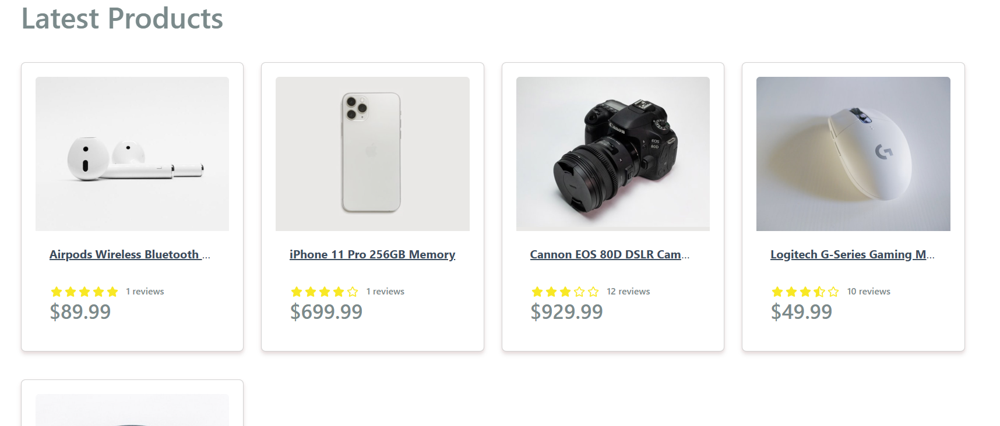
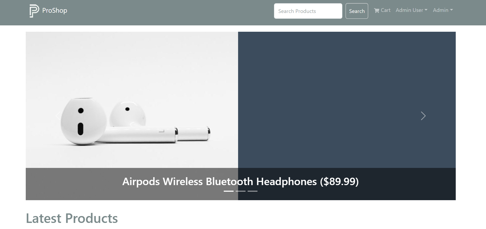
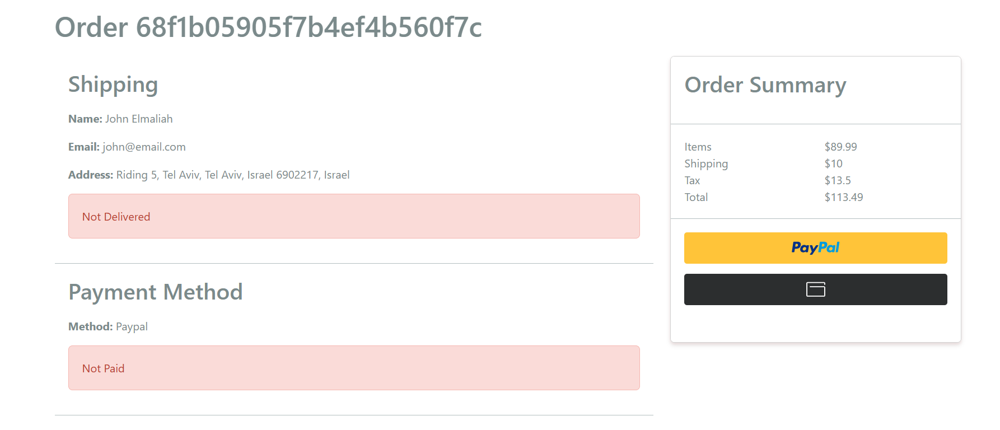
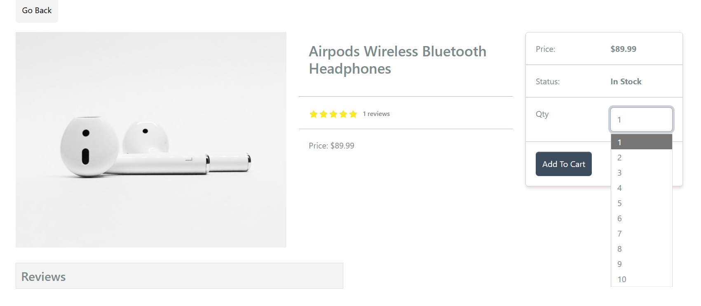
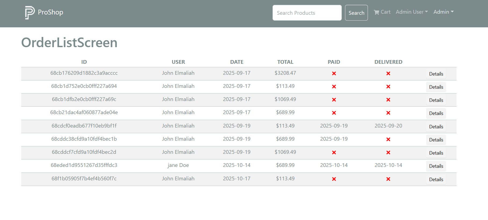
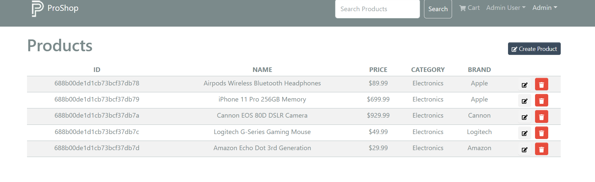

# ProShop MERN eCommerce Platform

A full-featured eCommerce application built using the **MERN stack** (MongoDB, Express, React, Node.js) and **Redux Toolkit**.  
Users can browse products, add items to their cart, place orders, pay securely via **PayPal**, and manage their account.  
Admins can manage users, products, and orders through a protected dashboard.

---

## Deployment

The application is deployed at [https://proshop-qahv.onrender.com](https://proshop-qahv.onrender.com)

---

## Features

### User Features

- User registration and login (JWT authentication)
- Profile management
- Add/remove products from cart
- Checkout and shipping information
- PayPal payment integration
- Order history and details

### Admin Features

- Manage products (create, edit, delete)
- Upload product images
- Manage users (view, edit, delete)
- Manage and mark orders as delivered

---

## Tech Stack

**Frontend:** React, Redux Toolkit, React Router, React Bootstrap  
**Backend:** Node.js, Express.js, Mongoose  
**Database:** MongoDB  
**Authentication:** JWT (JSON Web Token)  
**Payments:** PayPal REST API  
**Deployment:** Render  

---

## Installation & Setup

### 1. Clone the repository

```bash
git clone https://github.com/yourusername/proshop.git
cd proshop
```

### 2. Install dependencies

```bash
# Backend dependencies
npm install

# Frontend dependencies
npm install --prefix frontend
```

### 3. Configure environment variables

Create a `.env` file in the project root and add:

```bash
NODE_ENV=development
PORT=5000
MONGO_URI=your_mongo_connection_string
JWT_SECRET=your_jwt_secret
PAYPAL_CLIENT_ID=your_paypal_client_id
```

---

## Scripts

```bash
# Run backend only
npm run server

# Run frontend only
npm run client

# Run both concurrently (backend + frontend)
npm run dev

# Import sample data
npm run data:import

# Destroy sample data
npm run data:destroy

# Build frontend for production
npm run build
```

---

## Screenshots













